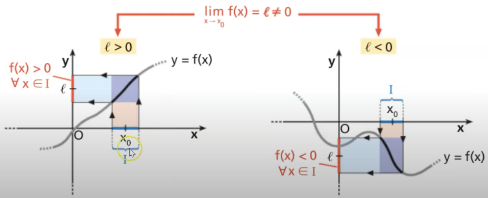

# mathcheatsheet
A simple math cheatsheet for fast search 🔍 

### Index
- [mathcheatsheet](#mathcheatsheet)
    - [Index](#index)
    - [Second order linear equations](#second-order-linear-equations)
    - [Notable products](#notable-products)
    - [Third order or more linear equations](#third-order-or-more-linear-equations)
    - [Disequations](#disequations)
    - [Logarithms](#logarithms)
    - [Limits](#limits)
    - [Derivatives](#derivatives)

### Second order linear equations
given the following assumptions:

$ax^2+bx+c$ and $\Delta = b^2 - 4ac,$ for:
1) $\Delta > 0 :$ we have two solutions in $\R$
2) $\Delta = 0 :$ we have two solutions (same point) in $\R$
3) $\Delta < 0 :$ we have **no** solution in $\R$

Main formula, with $\Delta>=0$: $$x{_1,_2}=\frac{-b - \sqrt{b^2-4ac}}{2a}$$

### Notable products
*    $(a-b)^2 = a^2+2ab+b^2$ 
*    $(a+b+c)^2 = a^2+b^2+2ab+2ac+2bc$
*    $(a-b+c)^2 = a^2+b^2-2ab+2ac-2bc$
*    $(a+b)^3 = a^3+3a^2b+3a^b2+b^3$
*    $(a-b)^3 = a^3-3a^2b+3a^b2-b^3$
*    $a^2-b^2 = (a-b)(a+b)$
*    $a^3+b^3 = (a+b)(a^2-ab+b^2)$
*    $a^3-b^3 = (a-b)(a^2+ab+b^2)$

### Third order or more linear equations
If no notable product is found, than we can **try** *Ruffini's Method*. We shall have at end of the process:

  $$P(x)=(x-a)Q(x)$$ with $Q(x)$ as a polinome with $P(x)$-1 order.

1) We need to calculate $f(x)$ substituting $x$ with each divisor of $c$ until we take the result 0 (satisfied equation).
2) When found, apply the matrix method (see a reference). The result **must be** 0 for the known term.
3) Write the result in the given form and apply the method again if necessary (but first, see if you have a *notable product*).

---

### Disequations

First order disequations are resolved like simple equations, keeping in mind that if you multiply or divide both members for a constant (changing the sign), also the disquation symbol must be inverted.

For second order disequations, you can resolve the second order equation and with $a \ne 0$:

$ax^2+bx+c$ and $\Delta = b^2 - 4ac,$ for:
1) $\Delta > 0 :$ we have two solutions in $\R$, so solution : $x_{1} < x, x > x_{2}$
2) $\Delta = 0 :$ we have two solutions (same point) in $\R$, so solution is $\forall x \ne x1,x2$ (where $x_{1}= x_{2}$)
3) $\Delta < 0 :$ we have **no** solution in $\R$, so solution is $\forall x$

---

### Logarithms
*    $a^{\log{_a}{b}} = b$ (definition)
*    $\log{_a}{b^c} = c\log{_a}{b}$ (Exponent)
*    $\log{_a}{bc} = \log{_a}{b}+\log{_a}{c}$ (Product)
*    $\log{_a}{\frac{b}{c}} = \log{_a}{b}-\log{_a}{c}$ (Quotient)
*    $\log{_a}{b} = \frac{\log{_c}{b}}{\log{_c}{a}}$ (Base conversion)
*    $\log{_a}{b} = \frac{1}{\log{_b}{a}}$ (Inversion)

---

### Limits

If $f(x)$ is defined and continuous in the limit segment we want to calculate, than we can proceed. Put the limit value inside function and see if the result is an *L* $\in \R$.

**Determinated forms**

If *L* is $[\frac{C}{0^+}], [\frac{C}{0^-}], [\frac{\infin}{0}]$, the limit is $\plusmn\infin$,
if *L* is $[\frac{C}{\infin}], [\frac{\infin}{0}]$, the limit is 0

**Undeterminated forms**

If *L* is $[\frac{0}{0}], [\frac{\infin}{\infin}], [\infin-\infin], [0^\infin], [0^0], [1^\infin]$ and more...the limit must be calculated with the right theorem.

**Constant sign theorem**

If:

$$\lim_{x \rArr x_{0}} f(x) = l \ne 0$$

than, a surrounding area of $x_{0}$ exists, where **both** $l$ and $f(x)$ are **both** positive or both negative.

**Comparing theorem**
If you have $ h(x) \le f(x) \le g(x)$ three functions defined in the surrounding area $H$ of $x_{0}$ (not defined in $x_{0}$) so, if in $H$ is always valid:

$$h(x)  \le f(x) \le g(x) $$

than, if the limit for $x \rArr x_{0}$ is $l$, the limit for $f(x)$ is **also** $l$.

**Limit uniqueness theorem**
If $f(x)$ has limit $l$ for $x \rArr x_{0}$, than $l$ is **unique**.

**Notable limits**
 There are some limits for whom the existence of limit and proofness is battle-tested. They are known and they are all $\frac{0}{0}$ cases, but not the last (Neplero's number, $1^{\infin} $). 
 *N.B:* Not all cases are shown.

*    **Logarithmic** function, with $a > 0$ and $a \ne 1$:
    $$\lim_{x \rArr 0}\frac{log_{a}(1+x)}{x} = \frac{1}{ln(a)};  \lim_{f(x) \rArr 0}\frac{log_{a}(1+f(x))}{f(x)} = \frac{1}{ln(a)}$$
    
so, with $a = e$:
    $$\lim_{x \rArr 0}\frac{ln(1+x)}{x} = 1;  \lim_{f(x) \rArr 0}\frac{ln(1+f(x))}{f(x)} = 1$$  

*    **Exponential** function, with $a > 0$:
    $$\lim_{x \rArr 0}\frac{a^x-1}{x} = ln(a);  \lim_{f(x) \rArr 0}\frac{a^{f(x)}-1}{f(x)} = ln(a)$$

so, with $a = e$:
    $$\lim_{x \rArr 0}\frac{e^x-1}{x} = 1;  \lim_{f(x) \rArr 0}\frac{e^{f(x)}-1}{f(x)} = 1$$

*    **Power with difference** with $c \in \R$:
    $$\lim_{x \rArr 0}\frac{(1+x)^c-1}{x} = c;  \lim_{f(x) \rArr 0}\frac{(1+f(x))^c-1}{f(x)} = c$$

*    **Neplero's number**
    $$\lim_{x \rArr \plusmn\infty}(1+\frac{1}{x})^x = e;  \lim_{f(x) \rArr \plusmn\infty}(1+\frac{1}{f(x)})^{f(x)} = e$$

### Derivatives
